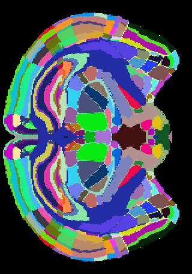
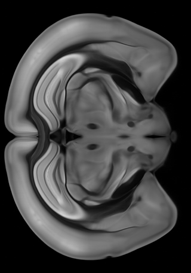

# Allen Mouse Brain ImageLoader
Two small tools to render the annotation and images of the Allen Mouse Brain Atlas.
Both tools take different input files but generate 1304 images of the Mouse Brain (456 sagital, 528 coronal and 320 axial)

## Example Image
Coronal slice 300 created from both tools





This repository contains two projects:

## Allen Mouse Brain Annotation Loader
Loads the *annotation.raw* volume data from the Allen Mouse Brain Atlas and creates images for every slice. Every structure will have a random color.


### Data
The raw data is not provided in this repository. You can download the needed data from the Allen Brain Atlas Project:

The *Annotation Loader* reads the annotation of the structural volume. The data can be found in this [zip file](http://download.alleninstitute.org/informatics-archive/current-release/mouse_annotation/P56_Mouse_annotation.zip). The file in question is annotation.raw. For more information on the format read the [documentation](http://help.brain-map.org/display/mousebrain/API).

### Usage
Compile the code and execute the binary with the following parameters: 

```AllenMouseBrainAnnotationLoader.exe <path-to-the-annotation.raw> <output-path>```

## Allen Mouse Brain Average Image Loader
Loads the sagital slices images of the atlas and creates all images of the other axis

### Data
The raw data is not provided in this repository. You can download the needed data from the Allen Brain Atlas Project:

The *Image Loader* uses the image data from the [Brain Explorer 2](http://mouse.brain-map.org/static/brainexplorer) (an awesome tool, btw.). Download the following [zip file](http://www.brain-map.org/BrainExplorer2/Atlases/Mouse_Common_Coordinate_1.zip) and copy the images from *zip-file*\Spaces\P56\AtlasSlices in a folder.

## Usage
Compile the code and execute the binary with the following parameters:

```AllenMouseBrainAverageImageLoader.exe <path-to-the-image-folder> <output-path>```